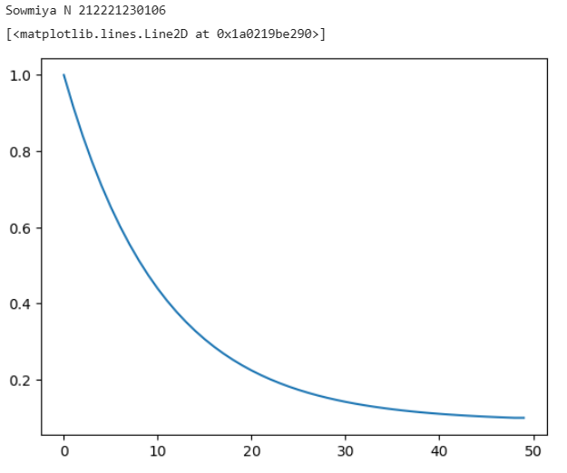

# CART POLE BALANCING

## AIM
To develop and fine tune the Monte Carlo algorithm to stabilize the Cart Pole.

## PROBLEM STATEMENT

The project focuses on developing an efficient Monte Carlo control algorithm specifically tailored for stabilizing the Cart Pole system. With the objective of achieving robust stability, the aim is to fine-tune the algorithm to effectively balance the Cart Pole. Through rigorous development and testing, the goal is to optimize the algorithm's performance and reliability in stabilizing the Cart Pole under various conditions.

## MONTE CARLO CONTROL ALGORITHM FOR CART POLE BALANCING
*  Import necessary libraries such as gym, numpy, tqdm, time, and matplotlib.pyplot.
* Define constants and global variables required for the algorithm, like the number of bins, initial Q-values, and decay parameters.
* Define functions for state discretization based on bins and for creating a decay schedule for alpha and epsilon values.
* Implement a function to generate trajectories using an epsilon-greedy policy.
* Develop the Monte Carlo control algorithm to update Q-values iteratively based on observed trajectories, using epsilon-greedy policy and decaying alpha and epsilon values.
* Run the Monte Carlo control algorithm using provided Q-values and default or modified parameters, optionally considering using previous Q-values.
*  Implement functionality to save or load Q-values from/to a file for later use.
 *   If necessary, include code to visualize the results, such as plotting epsilon decay over episodes.
 *   Test the algorithm with various parameters and environments to ensure it behaves correctly.
 *   Document and optimize the code for readability and efficiency, adding comments and refining variable names where necessary.

## MONTE CARLO CONTROL FUNCTION
```
def mc_control (env,n_bins=g_bins, gamma = 1.0,
                init_alpha = 0.5,min_alpha = 0.01, alpha_decay_ratio = 0.5,
                init_epsilon = 1.0, min_epsilon = 0.1, epsilon_decay_ratio = 0.9,
                n_episodes = 3000, max_steps = 200, first_visit = True, init_Q=None):
    
    nA = env.action_space.n
    discounts = np.logspace(0, max_steps,
                            num = max_steps, base = gamma,
                            endpoint = False)
    alphas = decay_schedule(init_alpha, min_alpha,
                            0.9999, n_episodes)
    epsilons = decay_schedule(init_epsilon, min_epsilon,
                            0.99, n_episodes)
    pi_track = []
    global Q_track
    global Q
    
    
    if init_Q is None:
        Q = np.zeros([n_bins]*env.observation_space.shape[0] + [env.action_space.n],dtype =np.float64)
    else:
        Q = init_Q
        
    n_elements = Q.size
    n_nonzero_elements = 0
    
    Q_track = np.zeros([n_episodes] + [n_bins]*env.observation_space.shape[0] + [env.action_space.n],dtype =np.float64)
    select_action = lambda state, Q, epsilon: np.argmax(Q[tuple(state)]) if np.random.random() > epsilon else np.random.randint(len(Q[tuple(state)]))

    progress_bar = tqdm(range(n_episodes), leave=False)
    steps_balanced_total = 1
    mean_steps_balanced = 0
    for e in progress_bar:        
        trajectory = generate_trajectory(select_action, Q, epsilons[e],
                                    env, max_steps)
        
        steps_balanced_total = steps_balanced_total + len(trajectory)
        mean_steps_balanced = 0
        
        visited = np.zeros([n_bins]*env.observation_space.shape[0] + [env.action_space.n],dtype =np.float64)
        for t, (state, action, reward, _, _) in enumerate(trajectory):
            #if visited[tuple(state)][action] and first_visit:
            #    continue    
            visited[tuple(state)][action] = True
            n_steps = len(trajectory[t:])
            G = np.sum(discounts[:n_steps]*trajectory[t:, 2])
            Q[tuple(state)][action] = Q[tuple(state)][action]+alphas[e]*(G - Q[tuple(state)][action])
        Q_track[e] = Q
        n_nonzero_elements = np.count_nonzero(Q)
        pi_track.append(np.argmax(Q, axis=env.observation_space.shape[0]))
        if e != 0:
            mean_steps_balanced = steps_balanced_total/e
        #progress_bar.set_postfix(episode=e, Epsilon=epsilons[e], Steps=f"{len(trajectory)}" ,MeanStepsBalanced=f"{mean_steps_balanced:.2f}", NonZeroValues="{0}/{1}".format(n_nonzero_elements,n_elements))
        progress_bar.set_postfix(episode=e, Epsilon=epsilons[e], StepsBalanced=f"{len(trajectory)}" ,MeanStepsBalanced=f"{mean_steps_balanced:.2f}")
        
    print("mean_steps_balanced={0},steps_balanced_total={1}".format(mean_steps_balanced,steps_balanced_total))
    V = np.max(Q, axis=env.observation_space.shape[0])
    pi = lambda s:{s:a for s, a in enumerate(np.argmax(Q, axis=env.observation_space.shape[0]))}[s]

    return Q, V, pi
```

## OUTPUT:




## RESULT:
Thus Monte Carlo algorithm to stabilize the Cart Pole is developed and fine tuned.
